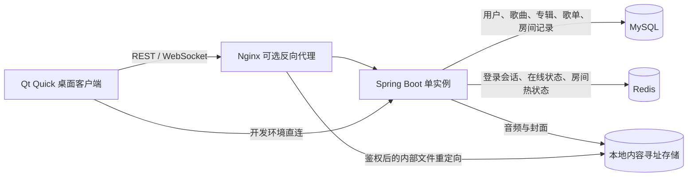

# Futari Music

**一起发现音乐，一起听见彼此。**

[License: MIT](LICENSE)

Futari Music 是一个可自行部署的同步听歌项目，由 **Qt Quick 桌面客户端**和 **Spring Boot 后端**组成。它将个人曲库、共享听歌房间、歌单管理，以及本地上传、下载与缓存整合到同一个客户端中。

客户端使用 C++17 与 QML，服务端使用 Java 17、MySQL 和 Redis。歌曲由用户上传到自己的服务器，播放控制通过 WebSocket 同步。

> **项目状态：持续开发中。** 当前验证环境为 Windows、Qt 6.8.3 / MinGW 和单实例 Spring Boot。尚未提供自动化发行包，也未完成跨平台和生产环境双客户端端到端验证。功能范围及限制见下文。

[快速开始](#快速开始) · [功能](#功能) · [架构](#架构) · [配置](#配置) · [测试](#测试) · [文档](#文档) · [参与贡献](#参与贡献)

## 目录

- [功能](#功能)
- [架构](#架构)
- [环境要求](#环境要求)
- [快速开始](#快速开始)
- [配置](#配置)
- [使用指南](#使用指南)
- [测试](#测试)
- [部署与数据维护](#部署与数据维护)
- [项目结构](#项目结构)
- [文档](#文档)
- [常见问题](#常见问题)
- [当前限制与后续方向](#当前限制与后续方向)
- [参与贡献](#参与贡献)
- [许可证与第三方素材](#许可证与第三方素材)

## 功能

| 模块 | 当前能力 |
| --- | --- |
| 曲库与播放器 | 搜索歌曲、播放控制、封面展示、LRC 歌词与当前行高亮、本地播放队列、下一首播放 |
| 同步听歌 | 创建、加入、离开房间；共享队列、播放状态同步；房主授予控制权；创建者解散房间 |
| 搭子与邀请 | 用户搜索、搭子收藏、一起听邀请、系统托盘通知、消息页同意或拒绝 |
| 歌单 | 个人歌单、服务器歌单、歌曲收藏、创建与改名、加歌与移除、歌曲排序 |
| 单曲与批量上传 | 元数据识别、嵌入封面提取、同目录歌词匹配、专辑选择与创建、上传前编辑和确认 |
| 任务中心 | 上传与下载队列、真实字节进度、暂停/继续、取消、失败重试、完成记录 |
| 下载与缓存 | 曲库下载、下载目录配置、缓存开关与路径、缓存空间统计和确认清理 |
| 管理 | 歌曲编辑与软删除、用户角色与权限、密码重置、强制下线、管理员初始化 |
| 界面 | 浅色/深色主题、自绘 SVG 图标、圆角弹层、歌曲悬停操作、页面前进与后退 |

**任务暂停规则：** 上传暂停会中止当前请求，继续时从头重传；下载在资源接口支持 HTTP Range 时使用断点续传，否则重新下载。任务状态与实际网络请求关联。完成任务进入历史页签，取消任务从队列移除。

**队列规则：** 个人本地队列与房间共享队列独立保存。在房间内且拥有控制权时，默认播放、添加与下一首操作作用于当前房间；无控制权时共享播放受限，默认添加作用于个人队列。离房或房间解散后恢复个人歌曲及位置，保持暂停。

## 架构



- **客户端：** QML 负责界面；C++ 负责鉴权请求、WebSocket、媒体播放、元数据解析、任务调度与本地文件操作。`Theme.qml` 与公共控件统一管理主题和交互状态。
- **业务服务：** 按用户、歌曲、专辑、歌单、房间、邀请等领域组织 Controller、DTO、Service、Mapper 与 Entity。
- **文件存储：** 音频及图片按内容 SHA-256 存储与去重，上传文件名不直接用于服务端存储路径。歌曲与专辑为多对一关系。
- **鉴权：** JWT 配合 Redis 登录会话；密码使用 BCrypt。REST、WebSocket 连接及控制消息均校验身份或权限。
- **同步：** 服务端广播播放基准和房间队列，客户端估算服务器时间并校正播放位置。音频仍由每个客户端分别获取和播放。

当前 WebSocket 会话保存在单个后端实例内存中，**不支持直接通过增加后端实例实现水平扩容**。

## 环境要求

| 组件 | 要求 / 用途 |
| --- | --- |
| JDK | 17，服务端编译与运行基线 |
| Maven | 3.9 系列；仓库未提供 Maven Wrapper |
| MySQL | 8.x，持久化业务数据 |
| Redis | 可连接的 Redis 服务，维护登录及房间状态 |
| Qt | 6.8 或更高；需 Quick、Quick Controls 2、Multimedia、Network、WebSockets、Widgets、SVG 模块 |
| C++ 编译器 | 支持 C++17，与安装的 Qt Kit 使用相同工具链和架构 |
| CMake | 3.21 或更高 |
| Ninja | 下文命令行构建示例使用的生成器 |
| Qt Test | 运行客户端回归测试时需要 |
| Nginx | 可选，部署时代理 API、WebSocket 及鉴权文件下载 |

后端依赖的准确版本见 [pom.xml](SpringBoot/pom.xml)，客户端模块要求见 [CMakeLists.txt](Qt/FutariMusic/CMakeLists.txt)。Qt 在其他系统上的可构建性和媒体格式支持需要自行验证。

## 快速开始

以下命令以 **Windows PowerShell** 为例。开始前将 JDK、Maven、MySQL 客户端、CMake 和 Ninja 加入 `PATH`；客户端构建还需使用所选 Qt Kit 的编译器环境。

### 1. 获取源码

将项目源码克隆或下载到本地，进入仓库根目录 `Futari-Music`。后续命令均说明所需工作目录。

### 2. 初始化数据库与 Redis

先启动 MySQL 和 Redis。在仓库根目录进入 MySQL 命令行：

```powershell
mysql -u root -p
```

在 MySQL 中执行：

```sql
SOURCE SpringBoot/sql/schema.sql;
```

该脚本创建 `futari` 数据库及完整表结构。已有旧数据库的升级方式见[部署与数据维护](#部署与数据维护)，不要重复执行旧版本迁移。

### 3. 配置后端

在仓库根目录复制配置模板：

```powershell
Copy-Item SpringBoot/.env.example SpringBoot/.env
```

编辑 `SpringBoot/.env`，至少填写：

- `DB_URL`、`DB_USER`、`DB_PASSWORD`：实际数据库连接信息。
- `REDIS_HOST`、`REDIS_PORT`、`REDIS_PASSWORD`：实际 Redis 连接信息。
- `JWT_SECRET`：至少 32 字节的随机密钥；不能为空。
- `BOOTSTRAP_ADMIN_PASSWORD`：首次初始化管理员时设置 12～72 个字符的密码。

管理员用户名默认 `admin`，**项目没有固定管理员密码**。引导密码由部署者设置；初始化成功后可清空该配置，数据库中的密码哈希保持有效。已有同名管理员默认不会被重置。

未设置引导密码且数据库尚无用户时，第一个注册账户会成为管理员。对外开放服务前，建议先完成管理员初始化。

### 4. 启动后端

在仓库根目录执行：

```powershell
Set-Location SpringBoot
mvn test
mvn spring-boot:run
```

后端默认监听 `http://127.0.0.1:8080/`。当前启动方式以 `SpringBoot` 为工作目录，`MUSIC_STORAGE_DIR=./music-storage` 会解析为该目录下的 `music-storage`。

也可打包运行：

```powershell
# 工作目录：SpringBoot
mvn clean package
java -jar target/futari-0.1.0.jar
```

### 5. 构建客户端

**Qt Creator：** 打开 `Qt/FutariMusic/CMakeLists.txt`，选择包含所需模块的 Qt 6.8+ Kit，配置、构建并运行 `appFutariMusic`。

**命令行：** 在仓库根目录使用与 Qt Kit 匹配的编译器环境。把实际 Qt 安装目录保存为 `QT_ROOT`，例如该目录应包含 `bin`、`lib` 和 `lib/cmake/Qt6`；同时保证 Kit 编译器与 Ninja 可在 `PATH` 中找到。

```powershell
# QT_ROOT 应预先设置为本机 Qt Kit 的实际目录。
$env:PATH = "$env:QT_ROOT/bin;$env:PATH"
cmake -S Qt/FutariMusic -B Qt/FutariMusic/build -G Ninja "-DCMAKE_PREFIX_PATH=$env:QT_ROOT"
cmake --build Qt/FutariMusic/build --parallel
& ./Qt/FutariMusic/build/appFutariMusic.exe
```

单配置 Ninja 构建的可执行文件位于构建目录。使用其他生成器时，以生成器实际输出路径为准。直接运行依赖 Qt 运行时；向其他机器分发时需另外部署相应运行库与 QML/媒体插件。

### 6. 登录并上传第一首歌曲

在登录页将服务器地址设为 `http://127.0.0.1:8080/`，使用刚初始化的管理员登录。客户端初始地址是 `http://127.0.0.1:8081/`，对应可选 Nginx 代理；没有部署代理时必须改为后端直连地址。

进入曲库，选择「上传 → 单曲上传」，检查自动填充信息、专辑、封面和歌词，确认后加入上传队列。上传成功后刷新曲库即可播放。

## 配置

配置模板为 [SpringBoot/.env.example](SpringBoot/.env.example)。应用可从仓库根目录或 `SpringBoot` 工作目录读取该文件，也支持启动进程环境变量。修改后端配置后需重启服务。

| 变量 | 默认值 | 说明 |
| --- | --- | --- |
| `SPRING_PROFILES_ACTIVE` | `dev` | 开发环境；部署时可使用 `prod` |
| `DB_URL` | 本地 `futari` 数据库 | JDBC 连接地址 |
| `DB_USER` / `DB_PASSWORD` | `root` / 空 | 数据库账号与密码 |
| `REDIS_HOST` / `REDIS_PORT` | `127.0.0.1` / `6379` | Redis 地址 |
| `REDIS_PASSWORD` | 空 | Redis 认证密码 |
| `JWT_SECRET` | 空，无可用默认值 | 至少 32 字节；为空或过短时启动失败 |
| `JWT_TTL_SECONDS` | `86400` | 登录令牌有效期，秒 |
| `BOOTSTRAP_ADMIN_USERNAME` | `admin` | 引导管理员账号 |
| `BOOTSTRAP_ADMIN_NICKNAME` | `管理员` | 引导管理员昵称 |
| `BOOTSTRAP_ADMIN_PASSWORD` | 空 | 设置后执行管理员初始化 |
| `BOOTSTRAP_ADMIN_RESET_EXISTING` | `false` | 单次管理员恢复：授予管理员角色、重置密码并撤销登录令牌 |
| `MUSIC_STORAGE_DIR` | `./music-storage` | 服务端音频与封面目录，相对于启动工作目录 |
| `FUTARI_UPDATE_DIR` | `./updates` | 客户端更新包缓存目录，按 `windows-x64`、`ubuntu-amd64` 分子目录 |
| `FUTARI_UPDATE_GITHUB_REPOSITORY` | `ProgramCX/Futari-Music` | 后端轮询 GitHub Releases 的仓库 |
| `FUTARI_UPDATE_POLL_ENABLED` | `true` | 是否启用后台更新包轮询 |
| `FUTARI_UPDATE_POLL_INTERVAL_MS` | `600000` | 轮询间隔，默认 10 分钟 |
| `FUTARI_UPLOAD_MAX_AUDIO_SIZE` | `64MB` | 单个音频文件上限 |
| `FUTARI_UPLOAD_MAX_REQUEST_SIZE` | `80MB` | 完整 multipart 请求上限 |
| `CORS_ALLOWED_ORIGINS` | `http://localhost:3000` | 后端允许的浏览器跨域来源；客户端本身为桌面应用 |

上传大小使用 Spring `DataSize` 格式，如 `128MB`、`1GB`。请求上限需为封面、歌词和 multipart 开销留出余量；使用 Nginx 时还应同步调整 `client_max_body_size`。

`BOOTSTRAP_ADMIN_RESET_EXISTING=true` 仅用于明确的账号恢复，成功后改回 `false` 或移除该配置，避免每次启动重置账号。

客户端设置通过 `QSettings` 持久化：服务器地址、主题、自动登录选择、下载与缓存目录等。下载默认使用当前用户的系统 Music 目录，应用缓存默认使用 Qt 标准应用数据目录。自动登录保存登录令牌，不保存账号密码。

客户端自动更新接口、兼容版本链、发行附件命名和发布步骤见[客户端自动更新与发行约定](Qt/doc/客户端自动更新与发行约定.md)。

## 使用指南

### 上传与专辑

- 单曲和批量上传默认开启「根据元信息自动填充」和「自动查找歌词」。客户端尝试读取标题、歌手、专辑、时长及嵌入封面，缺失字段可手动填写。
- 歌词从音频所在目录按文件名主体精确匹配，优先 `.lrc`、其次 `.txt`，扩展名不区分大小写；匹配失败不影响上传。
- 批量选择文件后先完成预处理与编辑确认，再加入任务队列；每首歌独立保存歌词与修改结果。
- 专辑按名称和艺术家匹配；无法唯一确定时由用户选择。多首歌可以关联同一专辑，用户未选择或创建专辑时保持未关联。

### 歌单与歌曲操作

歌曲行悬停显示喜欢、下载、添加和更多操作。喜欢写入个人「我喜欢」歌单；添加菜单支持队列、已有歌单和新建歌单；更多菜单提供播放、下一首播放，以及有权限时的歌曲编辑。个人与服务器歌单读取时跳过已删除歌曲，原关联仍保留。

### 权限

| 操作 | 允许的身份 |
| --- | --- |
| 浏览曲库、播放、下载、个人歌单、搭子与邀请 | 已登录用户 |
| 上传歌曲 | 管理员，或已授予 `canUpload` 的用户 |
| 修改服务器歌单 | 管理员，或已授予 `canManageServerPlaylist` 的用户 |
| 编辑、删除歌曲与管理用户 | 管理员 |
| 控制房间播放和共享队列 | 在房的创建者，或获得控制权的成员 |
| 解散房间 | 创建者；离房后仍可解散 |

一起听邀请同时进入消息页和系统托盘通知。通知是否显示取决于操作系统及通知权限，消息页仍可处理邀请。

## 测试

### 后端

在仓库根目录运行：

```powershell
mvn -f SpringBoot/pom.xml test
```

测试覆盖鉴权、管理员初始化、歌曲上传与编辑、失效歌曲的歌单读取、排序和房间权限等业务。当前测试主要使用 Mock，不替代 MySQL、Redis、Nginx 及双客户端联调。

### 客户端

在配置好 Qt Kit 编译环境的仓库根目录运行：

```powershell
# 元数据与上传表单回归
cmake -S Qt/FutariMusic/tests/metadata-probe -B Qt/FutariMusic/build-metadata-probe -G Ninja "-DCMAKE_PREFIX_PATH=$env:QT_ROOT"
cmake --build Qt/FutariMusic/build-metadata-probe --parallel
ctest --test-dir Qt/FutariMusic/build-metadata-probe --output-on-failure

# 播放、网络、任务、歌单、房间与实际 QML 界面回归
cmake -S Qt/FutariMusic/tests/playback-ui -B Qt/FutariMusic/build-playback-ui -G Ninja "-DCMAKE_PREFIX_PATH=$env:QT_ROOT"
cmake --build Qt/FutariMusic/build-playback-ui --parallel
ctest --test-dir Qt/FutariMusic/build-playback-ui --output-on-failure
```

元数据测试使用离屏渲染；播放与界面测试当前指定 Windows 平台插件，需要 Windows 桌面环境。测试通过本机替身 HTTP/WebSocket 服务运行真实客户端网络逻辑，并使用临时配置存储，不要求连接实际业务服务器。

最近一轮验证通过后端 28 个测试、客户端播放/UI 回归和客户端构建。验证记录见[客户端实现说明](Qt/doc/客户端实现说明.md)；仓库目前没有 CI 工作流，不能据此推断所有环境均已通过。

## 部署与数据维护

### 后端与 Nginx

部署步骤及完整接口见[后端实现与部署](SpringBoot/doc/后端实现与部署.md)。Nginx 示例位于 [SpringBoot/nginx/futari.conf.example](SpringBoot/nginx/futari.conf.example)，默认监听 `8081` 并转发到 Spring 的 `8080`。

部署时需将配置中的 `alias` 改为 `MUSIC_STORAGE_DIR` 对应的绝对路径并保留尾部 `/`。`/protected-music/` 必须保持 `internal`，由服务端鉴权后通过 `X-Accel-Redirect` 返回资源。开发环境可直连 Spring，仍支持鉴权下载及单段 HTTP Range。

对外服务应配置 HTTPS/WSS，并保护数据库、Redis 和 `.env`。当前 WebSocket 握手在查询参数中携带 token，代理访问日志应避免记录完整带令牌 URL。

### 数据库升级与备份

- **新数据库：** 执行 [schema.sql](SpringBoot/sql/schema.sql)，不再执行旧库迁移。
- **旧数据库：** 先备份，按数据库实际缺失版本依次执行 [001](SpringBoot/sql/migrations/001_song_metadata.sql)、[002](SpringBoot/sql/migrations/002_song_albums.sql)、[003](SpringBoot/sql/migrations/003_album_artist_identity.sql)。当前为手工 SQL 迁移，没有自动迁移框架；脚本不能任意重复执行。
- **备份：** MySQL 业务数据与音乐存储目录应配套备份。Redis 保存登录与房间热状态，恢复后客户端可能需要重新登录或加入房间。
- **歌曲删除：** 当前采用软删除，不立即回收内容寻址文件；重新上传相同的已删除音频可恢复歌曲 ID 及关联，元数据使用此次确认的信息。

## 项目结构

```text
Futari-Music/
├── README.md
├── .gitignore
├── .codex/
│   ├── rules/                    # 工程规范
│   └── skills/                   # 项目使用的设计与协作指引
├── Qt/
│   ├── FutariMusic/
│   │   ├── CMakeLists.txt
│   │   ├── main.cpp
│   │   ├── src/                  # C++ 网络、播放、元数据与任务管理
│   │   ├── qml/                  # 页面、公共控件、主题与 SVG 图标
│   │   └── tests/                # 独立 CMake/CTest 回归工程
│   ├── doc/                      # 客户端文档
│   └── 参考图片/                  # 界面参考素材
└── SpringBoot/
    ├── pom.xml
    ├── .env.example
    ├── src/main/                 # Java 业务与应用配置
    ├── src/test/                 # 后端测试
    ├── sql/                      # 建表与手工迁移脚本
    ├── nginx/                    # 反向代理示例
    └── doc/                      # 接口、协议与部署文档
```

`.gitignore` 忽略本地环境文件、上传资源、构建产物、依赖缓存、IDE 配置及日志；源码、测试、文档、配置模板和项目工程规范保留在版本控制范围内。

## 文档

| 文档 | 内容 |
| --- | --- |
| [客户端实现说明](Qt/doc/客户端实现说明.md) | 已实现功能、构建、队列行为、验证记录及限制 |
| [客户端自动更新与发行约定](Qt/doc/客户端自动更新与发行约定.md) | 版本兼容规则、自动更新配置及 Windows/Ubuntu/GitHub Release 发布方式 |
| [Qt 客户端技术细节](Qt/doc/Qt客户端技术细节描述.md) | 客户端设计与技术目标，包含早期方案 |
| [后端实现与部署](SpringBoot/doc/后端实现与部署.md) | 实际 REST 接口、WebSocket 协议、数据、权限及部署 |
| [后端技术细节](SpringBoot/doc/后端技术细节描述.md) | 早期设计说明及后续补充 |
| [后端工程规范](.codex/rules/Futari后端AI编码规范.md) | Java 代码组织、依赖、异常、鉴权与工程约束 |

技术目标文档包含历史讨论；与当前行为不一致时，以代码、配置模板和实现文档为准。

## 常见问题

| 现象 | 检查方式 |
| --- | --- |
| 客户端无法连接服务器 | 未部署 Nginx 时使用 `8080`；已部署代理时使用代理地址，检查防火墙和 WebSocket 转发 |
| 后端启动失败 | 检查数据库表、MySQL/Redis 连接、JWT 密钥长度以及管理员引导配置 |
| 没有管理员账号或不知道密码 | 按「快速开始」配置引导账号；没有固定默认密码，已有账号不会自动被改密 |
| 上传到末尾失败或 HTTP 413 | 检查音频上限、完整请求上限及 Nginx 请求体上限；修改配置后重启或 reload |
| 自动识别不到封面或部分标签 | 检查文件内嵌标签与媒体后端支持；FLAC 有原生解析兜底，仍可手动补齐信息 |
| 歌曲点击后需要等待 | 当前先完整获取并校验音频，再开始播放，较大文件首次播放需要等待 |
| 歌单显示「资源不存在」 | 更新到包含失效歌曲容错的后端；旧进程不会自动加载新代码。确认具体业务错误码及日志 |
| 系统通知未出现 | 检查系统通知与托盘支持；通过右上角消息页处理邀请 |

提交问题时附上复现步骤、操作系统、Qt Kit/JDK 版本、相关错误码与脱敏日志，避免包含密码、JWT、私人音乐文件或完整 `.env`。

## 当前限制与后续方向

- 后端为单实例设计；多实例同步需要跨节点消息分发和更完整的原子状态处理。
- 播放尚未实现边下载边播，上传尚未实现分块断点续传。
- 上传和下载任务记录可恢复；重启后的未完成任务会按实际状态标记为可重试，不表示传输仍在运行。下载历史仅存于本机。
- 自动歌词匹配当前使用本地同目录文件，未实现在线歌词搜索。
- 音频标签、解码及系统通知能力受 Qt 媒体后端和操作系统影响，跨平台支持仍需验证。
- 当前没有 CI、自动发行流水线、自动数据库迁移或多实例部署方案。

后续可围绕流式播放、上传断点协议、跨平台验证、自动化构建发行和多实例同步推进。以上为待完善方向，不代表已有实现或交付承诺。

## 参与贡献

欢迎提交缺陷修复、测试、文档与功能改进。涉及数据库、权限、同步协议或新依赖的修改，建议先说明问题、兼容性与方案。

1. 从当前开发分支创建独立功能分支，保持改动聚焦。
2. 修改前阅读相关实现文档及[后端工程规范](.codex/rules/Futari后端AI编码规范.md)。后端按既有领域分层；Qt 页面通过 C++ 控制器访问业务，复用公共主题和控件。
3. 对行为变化补充适当的回归测试，运行受影响模块的构建和测试。
4. 接口、配置或数据库变化同步更新文档；数据库升级新增迁移脚本，避免删除已有用户数据。
5. 提交说明包括修改目的、复现方式、验证结果、兼容性及已知限制。建议提交格式：`feat:`、`fix:`、`docs:`、`test:`、`refactor:`，后接简明描述。

安全问题请通过仓库维护者提供的私密渠道反馈，公开报告不要包含可利用细节或密钥；本仓库目前未公布专门的安全联系地址。

## 许可证与第三方素材

本项目原创代码与文档采用 [MIT License](LICENSE) 发布。使用、修改或分发时应保留许可证中的版权声明和许可声明。第三方依赖及素材不因本项目采用 MIT 而改变其原有许可证或权利归属。

Qt、Spring Boot 及其他依赖分别遵循其自身许可证，发行时需按实际链接方式与依赖版本履行相应义务。`Qt/参考图片` 内的 QQ 音乐客户端截图用于界面设计参考，不代表项目属于 QQ 音乐或与其有合作关系，也不是本项目的产品截图。用户上传的歌曲、歌词与封面权利由对应权利人持有。
